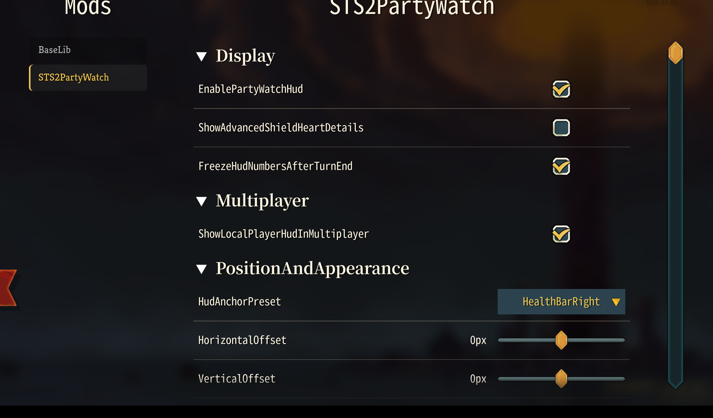
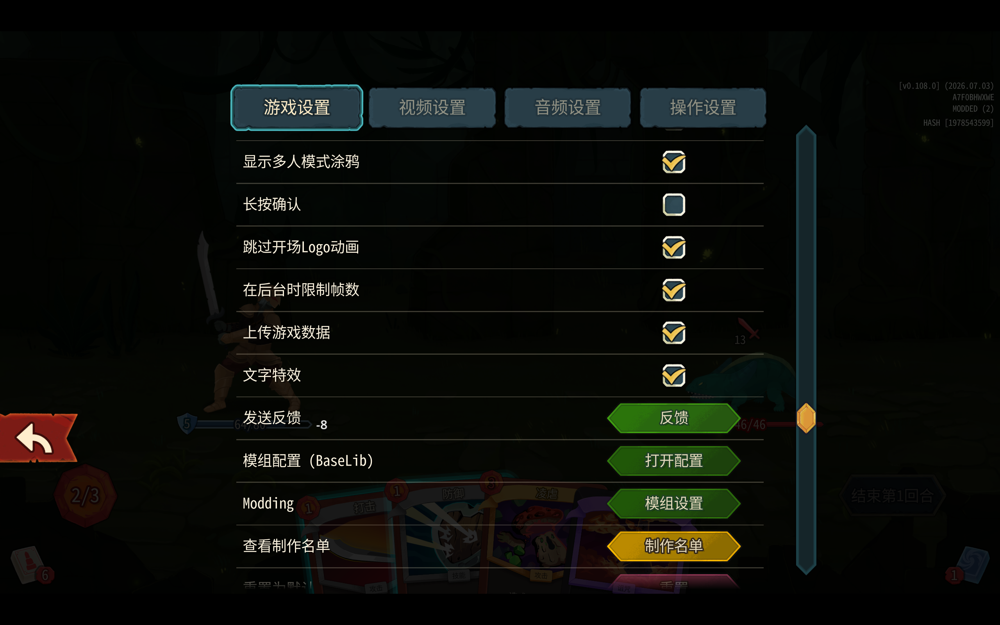

# Phase 12A Runtime Verification - 2026-07-03

## 结论

Phase 12A 的 BaseLib 自动生成配置页已完成一次用户侧运行时验证。

已确认：

- 从游戏主菜单进入 Mod Configuration 可以看到 `STS2PartyWatch`。
- `STS2PartyWatch` 配置页可打开。
- BaseLib 自动生成的分组、开关、下拉框、滑条等控件可显示并可操作。
- 用户反馈“各种操作也可以用”，因此本轮主菜单入口的自动配置页可记为可用。

仍不处理：

- 游戏内置战斗中设置面板里的 `模组配置（BaseLib）` / `打开配置` 通道目前使用不了。
- 该问题先记录为已知限制，不在 Phase 12A 当前收尾任务中修复。
- 不因此启动 Phase 12B 自定义右侧 UI，也不改 Poison 逻辑。

## 截图证据

主菜单 Mod Configuration 路径可用：



战斗内置通道存在，但当前不可用，先不处理：



## 观察

主菜单配置页截图中可见：

- 左侧 Mods 列表包含 `BaseLib` 和 `STS2PartyWatch`。
- 页面标题为 `STS2PartyWatch`。
- 自动生成分组包括 `Display`、`Multiplayer`、`PositionAndAppearance`。
- 字段名仍是代码属性名，例如 `EnablePartyWatchHud`、`HudAnchorPreset`、`HorizontalOffset`。
- 下拉值仍是枚举名，例如 `HealthBarRight`。

这说明 BaseLib 自动 UI 基线已经跑通，但显示文本还没有本地化或友好化。若后续要改善标签、描述、布局或右侧自定义 UI，应作为 Phase 12B 或单独 UI polish 任务处理。

## 验证边界

本记录只依据用户在 2026-07-03 提供的截图和说明：

```text
图1 从游戏主菜单进去可以操作，各种操作也可以用。
图2 是游戏内置的通道，但使用不了这个先不管，记录下来。
```

本轮没有继续由 Codex 操作游戏，也没有完成额外的多人、重启持久化、BaseLib 缺失行为、键鼠/controller focus 等扩展验证。
